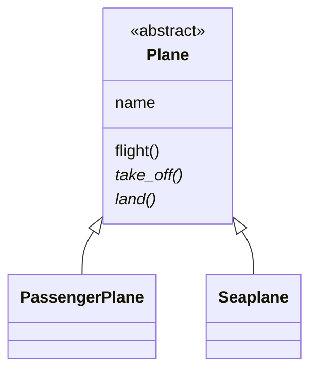
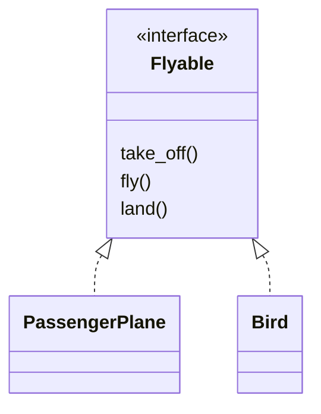

# Abstract classes vs. interfaces

Both define methods a class must implement. They differ in what else they carry and which classes they relate.

| | Abstract class | Interface |
|---|---|---|
| Relationship | "is a" (`Seaplane` is a `Plane`) | "can do" (`Bird` can fly) |
| State and implementation | Yes, shared with subclasses | No, only method signatures |
| Inheritance (Java, C#) | One base class | Many interfaces |
| In Python | `ABC` with concrete and `@abstractmethod` methods | `ABC` with only abstract methods, or `typing.Protocol` |

## Examples

- [`abstract_class.py`](../abstract_class.py): `Plane` stores a `name` and implements `flight()`, which calls the
  abstract steps `take_off()` and `land()` (a *template method*). `PassengerPlane` and `Seaplane` only fill in the
  steps.
- [`interface.py`](../interface.py): `Flyable` has no state and no code. A plane and a bird have nothing in common
  except that both can fly, so they share an interface, not a base class. The second part shows a `Protocol`:
  `Duck` fits `Swimmer` without inheriting from it.

## In Python

- Python allows multiple inheritance, so the line between the two is a convention, not a language rule.
- `ABC` checks at runtime: a class that misses an abstract method cannot be instantiated (`TypeError`).
- `Protocol` checks statically: a type checker such as mypy or pyright reports a mismatch, the runtime does not.
