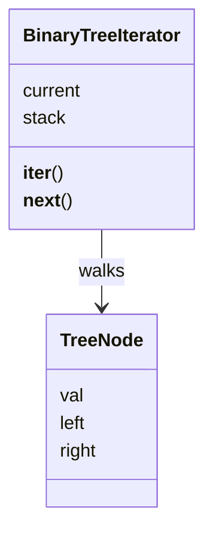

# Iterator

**Intent:** Access the elements of a collection one after another without exposing how the collection is stored.

## Example

[`behavioural/iterator.py`](../../behavioural/iterator.py) walks a binary tree in order (left, node, right).
`BinaryTreeIterator` keeps a stack of the nodes it still has to visit, so the caller only writes `for val in ...`.

## When to use

- A collection has a non-trivial structure (tree, graph, paginated API) and callers should not care about it.
- You need several ways to traverse the same structure (in order, pre order, breadth first).

## In Python

The pattern is built into the language: anything with `__iter__` and `__next__` works in a `for` loop. In most cases a
**generator** is shorter, because Python keeps the state for you. The file shows both versions; `inorder()` is the
generator.
