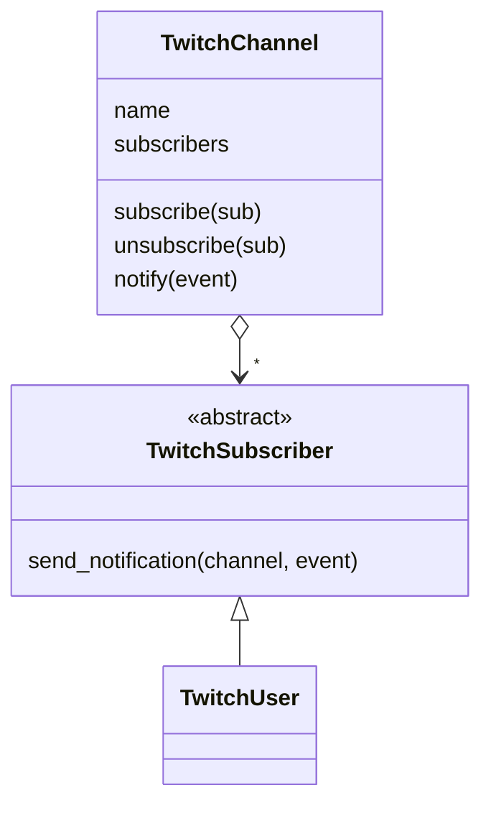

# Observer

**Intent:** Define a one-to-many dependency, so that when one object changes, all its dependents are notified.

## Example

[`behavioural/observer.py`](../../behavioural/observer.py): a `TwitchChannel` (the subject) keeps a list of
subscribers. `notify()` calls `send_notification()` on each one. The channel only knows the `TwitchSubscriber`
interface, not the concrete `TwitchUser` class.

## When to use

- Several objects must react to a change, and the set of objects changes at runtime.
- The sender should not depend on the receivers (event systems, GUIs, pub/sub).

## In Python

- A list of callables is often enough: `subscribers: list[Callable[[str, str], None]]`.
- Remember to unsubscribe. A subject holds strong references, so forgotten observers stay alive
  (`weakref.WeakSet` helps).
