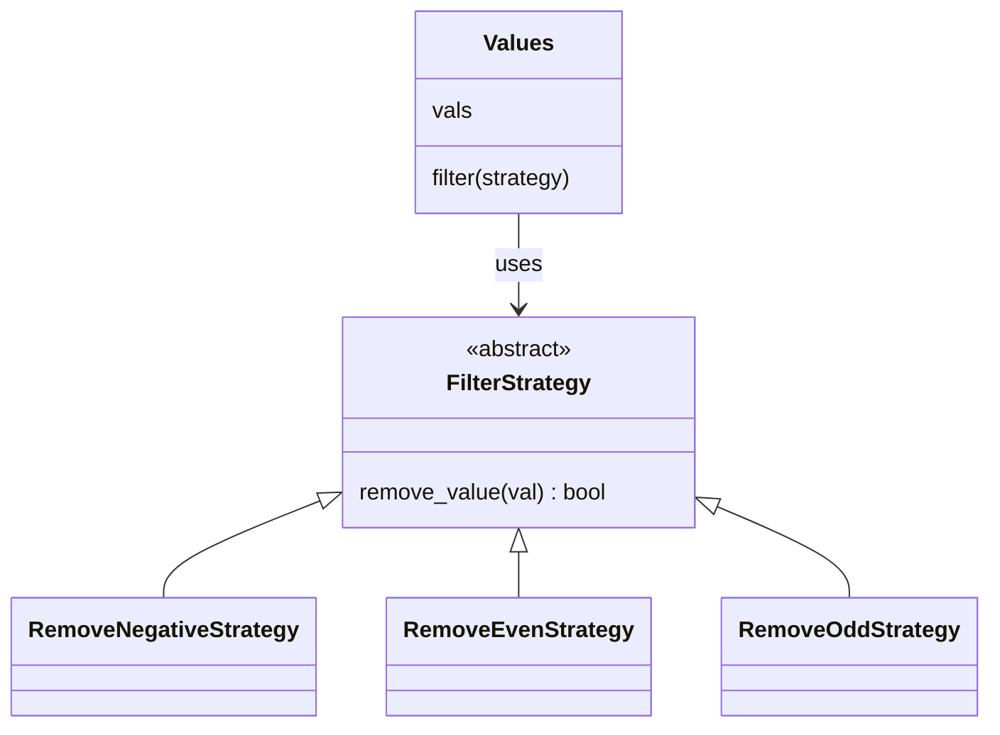

# Strategy

**Intent:** Define a family of algorithms, put each one in its own class, and make them interchangeable at runtime.

## Example

[`behavioural/strategy.py`](../../behavioural/strategy.py): `Values.filter()` does not know which values to drop.
The caller passes a strategy, and `filter()` asks it for each value.

## When to use

- There are several variants of an algorithm and you want to pick one at runtime.
- A method is full of `if mode == ...` branches.

## In Python

Functions are objects, so a strategy can be a plain function or a `lambda`. `Values.filter_with()` shows this; it
is how the built-ins `sorted(key=...)` and `filter()` work. Use classes when a strategy needs state or several methods.
