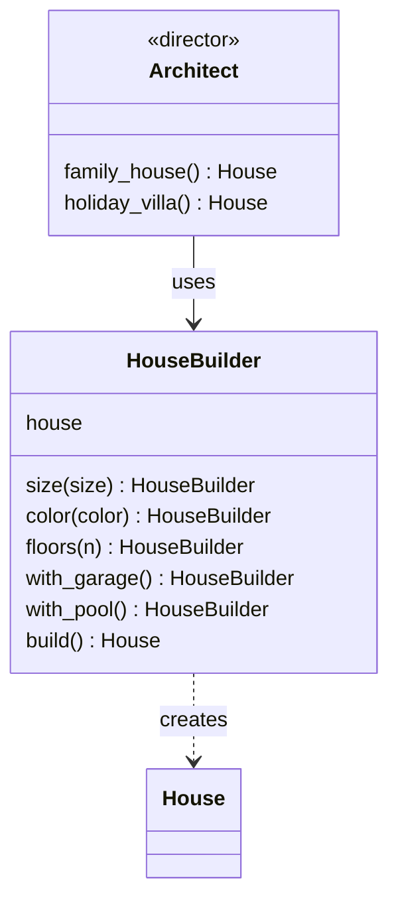

# Builder

**Intent:** Separate the construction of a complex object from its representation, so it can be built step by step.

## Example

[`creational/builder.py`](../../creational/builder.py): every builder method sets one part of the house and returns
the builder, so calls can be chained. `build()` returns the house and resets the builder. The optional `Architect`
(the "director") stores recipes for common houses.

## When to use

- An object has many optional parts, and a constructor with ten parameters would be hard to read.
- The same steps should produce different results (different builders, same director).

## In Python

Keyword arguments with defaults (or a `dataclass`) already cover many cases where Java needs a builder:
`House(size="large", garage=True)`. A builder is still useful when construction has an order, needs validation
between steps, or the object should be immutable once built.
