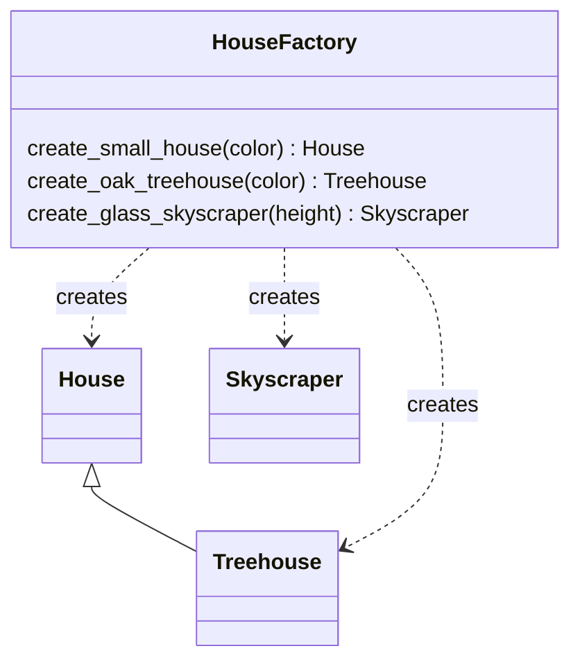

# Factory

**Intent:** Create objects through a dedicated method instead of calling constructors directly, so the caller does
not need to know the concrete class or its arguments.

## Example

[`creational/factory.py`](../../creational/factory.py): the caller asks for "an oak treehouse" and gets a
`Treehouse("small", color, "oak")`. Which class is used and which defaults apply is decided in one place.

This is a **simple factory**. The Gang of Four describe two related patterns:

- **Factory Method:** a base class declares `create_house()`, subclasses decide which class to return.
- **Abstract Factory:** an object that creates a whole family of related objects (e.g. all parts of a
  "modern" or a "rustic" house).

## When to use

- The concrete class depends on input or configuration.
- Creation needs defaults or setup that should not be repeated at every call site.

## In Python

Classes are callable, so a factory can be a dict (`{"oak": Treehouse, ...}`) or a `@classmethod` such as
`dict.fromkeys()` or `datetime.fromisoformat()`.
