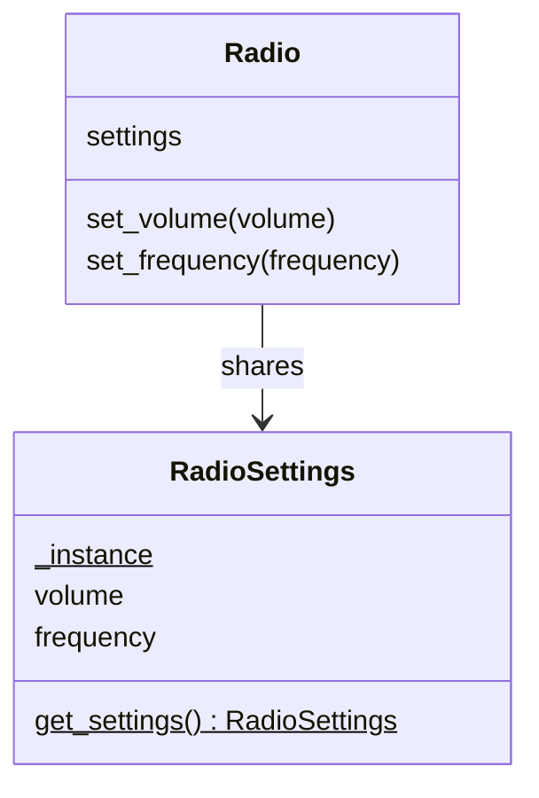

# Singleton

**Intent:** Make sure a class has only one instance and provide a global point of access to it.

## Example

[`creational/singleton.py`](../../creational/singleton.py): every `Radio` gets its settings from
`RadioSettings.get_settings()`, which creates the object once and then returns the same one. Changing the volume on
one radio changes it on all of them.

## When to use

- There must be exactly one of something: configuration, a connection pool, a logger.

## Pitfalls

- A singleton is global state. It hides dependencies and makes tests depend on each other (one test changes the
  volume, the next one sees it).
- Nothing stops `RadioSettings()` from creating a second instance; the class only offers the shared one.

## In Python

A **module** is already a singleton: it is imported once, and every import returns the same object. A module-level
instance (`settings = RadioSettings()`) is the most common solution. Passing the object in explicitly
(dependency injection) is often better still.
