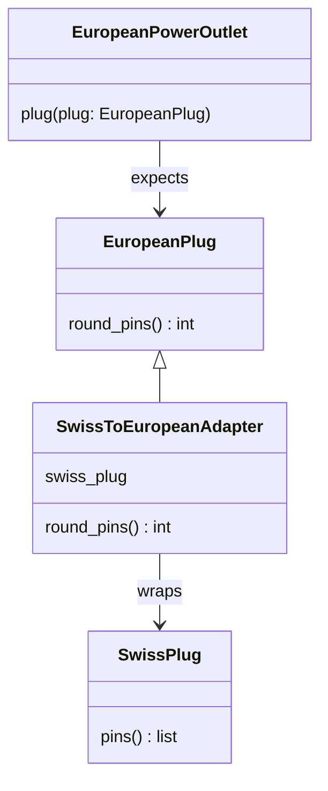

# Adapter

**Intent:** Convert the interface of a class into the interface a client expects, so classes with incompatible
interfaces can work together.

## Example

[`structural/adapter.py`](../../structural/adapter.py): the outlet calls `round_pins()`, but a `SwissPlug` only has
`pins()`. `SwissToEuropeanAdapter` wraps the Swiss plug and offers `round_pins()`, so neither the outlet nor the
plug has to change.

## When to use

- You want to use an existing class (a library, legacy code) whose interface does not fit.
- You want to swap one third-party library for another behind a stable interface.

## In Python

Duck typing means the adapter does not have to inherit from anything; it only needs the expected methods. Inheriting
from the target (as in the example) or declaring a `Protocol` documents the intent and helps type checkers.
