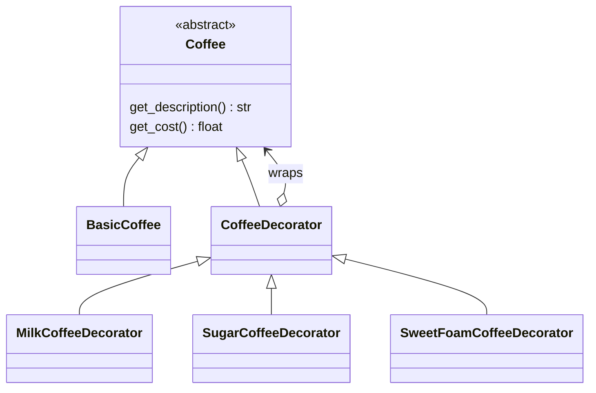

# Decorator

**Intent:** Add behaviour to an object dynamically by wrapping it in another object with the same interface.

## Example

[`structural/decorator.py`](../../structural/decorator.py): each decorator wraps a `Coffee`, is a `Coffee` itself,
and adds to the description and the price. Because the interface stays the same, decorators can be stacked in any
order: `SugarCoffeeDecorator(MilkCoffeeDecorator(BasicCoffee()))`.

## When to use

- You need combinations of optional features, and a subclass per combination would explode
  (`MilkSugarCoffee`, `MilkFoamCoffee`, ...).
- Features should be added or removed at runtime.

## In Python

Python's `@decorator` syntax is related but not the same thing: it wraps a **function** (or class) once, at
definition time, e.g. `@functools.cache`. The pattern here wraps **objects** at runtime. Both share the idea of
"same interface, extra behaviour".
