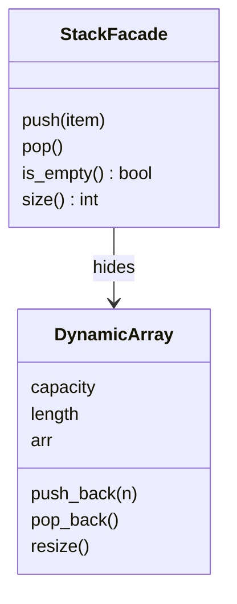

# Facade

**Intent:** Provide a simple interface to a complex subsystem.

## Example

[`structural/facade.py`](../../structural/facade.py): `DynamicArray` manages capacity and copies its elements when
it is full. `StackFacade` offers four methods and hides all of that; callers never see `capacity` or `resize()`.

## When to use

- A subsystem has many classes or steps, and most callers only need a few common operations
  (e.g. one `convert_video()` call instead of codec, buffer and file classes).
- You want a single entry point into a layer, to reduce coupling.

## In Python

Facades are often plain functions in a module, e.g. `shutil.copytree()` hides `os`, file handles and error handling.
A facade should not block access to the subsystem; advanced users can still use it directly.
